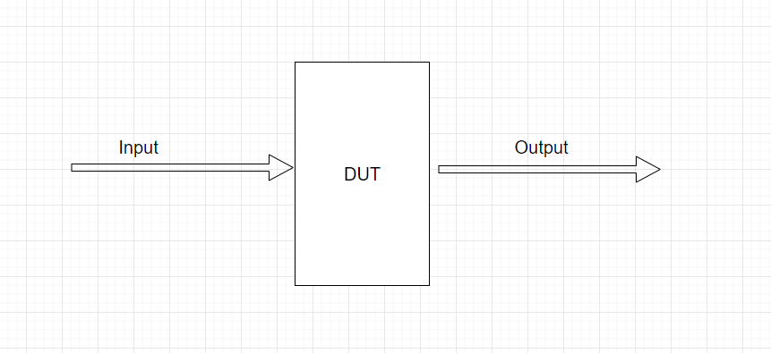
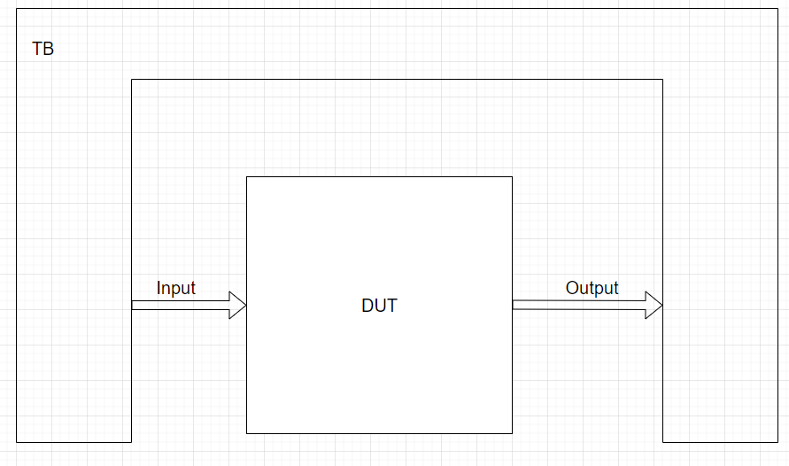

# Chap2.要开始历练了！

## Cucumber

从本章开始就要带着你进入(简单?)实操环节啦，在这个章节开始，为了让大家自主学习~~(才不是懒得写稿子)~~，自主掌握这个武器(语言)，所以还请大家**<u>自己</u>**去做会<u>**HDLBIT**</u>， 从真实的Coding中学学Verilog吧~顺便锻炼一下自己的英文阅读能力。(不是)

所以请点击 [这里][ HDL] ，去到新的练习场地吧~~

##### Q1：请完成PloblemSet中的1、Get Start ， 2.1 Basic ， 3.1.1 Basic Gate

##### A1 ： 将Q1中的每一个需要完成的截图（代码与通过提示、出错Debug思路）记录在准备提交的文档中。

~~~bash
# 可以尝试用不同写法完成一道题
# 请自己学会看时序图 ， 如果不了解，请回看《数字电子技术基础》
# 如果有余力的话可以继续往下做其他的内容，一样可以记录在文档中。
~~~

---

## 能不能自己整出时序图捏

当我们在HDLBits上面练习的时候，如果写错了，就会报出时序图出来，让我们来Debug。回想一下，之前在测试我们的工具还有环境的时候，我们也可以整出这样的时序图出来……如果我们能在进行自己编写的电路的测试的时候，也能整出时序图，我觉得会更加方便我们的Debug。所以，我的意思是，***或者我们可以在自己的环境里面整出来这种图？*** 

So，在这里以Iverilog这个工具为例，来具体说说**如何产生一个带有波形文件的TB**。

### 何为TB

TB，其实就是Test Bench。例如，我们编写了一个超吊的电路，正在为自己骄傲的同时，我们很自然也会想到——这玩意真的能运行正确吗？所以TB就是干这个工作的，它来帮助我们<u>验证(Verify)</u>电路的正确性。但针对不同的电路其实有着不同的验证方案，所以TB这东西是很少有通用的，如果需要验证某一具体电路，还是得靠自己写写相对应的TB。在这里也只能跟大家聊聊TB一般可以怎么写：

#### 我们的电路需要激励

一个电路，会有**输入I与输出O**，一般地，对于输入与输出会有这样的关系：

~~~latex
O = f(I) 
或者
O = F(signal_in_design)
~~~

也就是说，输出与输入相关（或者依赖于内部的信号，此时内部的信号相当于输入）。所以我们可以通过**给电路一些随机的输入，观察输出是否可以满足上面的关系。**在这里，我们叫这个待测试的电路为**DUT(Design Under Test)**。所以，TB需要做的事情就是，给到DUT一些激励，来**观察DUT的输出是否达到我们的设计目的**。

#### 给一个环境放下DUT

那么TB和DUT的关系是什么呢？又如何给到激励呢？

如下图所示，TB包裹着DUT，同时给到DUT输入激励，同时也根据DUT返回的输出信号来判断是否正确，由此来验证DUT设计的正确性。这就像一个硬件测试仪器连接到一个物理芯片/器件上，进行测试一样，这时，DUT对我们可以说是一个黑盒，我们只需要关心输入与输出的关系就可以了。

#### 怎么写

对于verilog，我们的一个简单的tb的结构可以这么写:

~~~verilog
`timescale 1ns/1ps    //simulation timescale
module tb();
	//test singals 
    ...
    ...
    
    //dut module 
    dut __dut(
        .signal1(),
        .signal2(),
        .....
    );
    
    //initial block 
    initial begin
    	....
        ....
    end
endmodule
~~~

再加上，我们需要出图给到gtkwave，来观察时序图，这部分还需要一些语句来描述，这部分就自己找吧。

##### Q2	： 请自己参考example的结构，写一个电路，该电路功能为：

* 拥有9个按键
* 拥有16个led。其中8个为流水灯led。
* 其中，1个按键控制 控制流水灯led 继续或者暂停。另外八个分别控制另外的8个led亮灭
* 按键为1表示有效，led为1表示亮。

##### A2	：结果写到记录里。

[ HDL]: https://hdlbits.01xz.net/wiki/Main_Page

